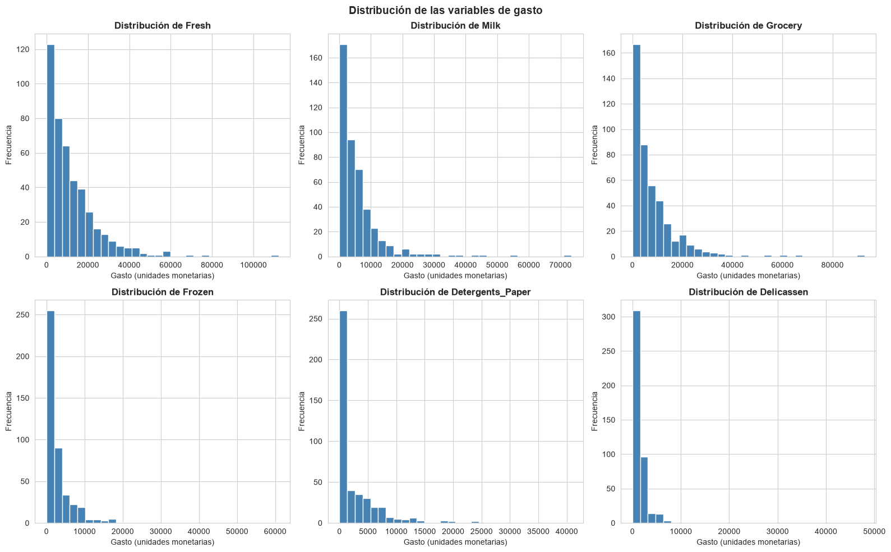
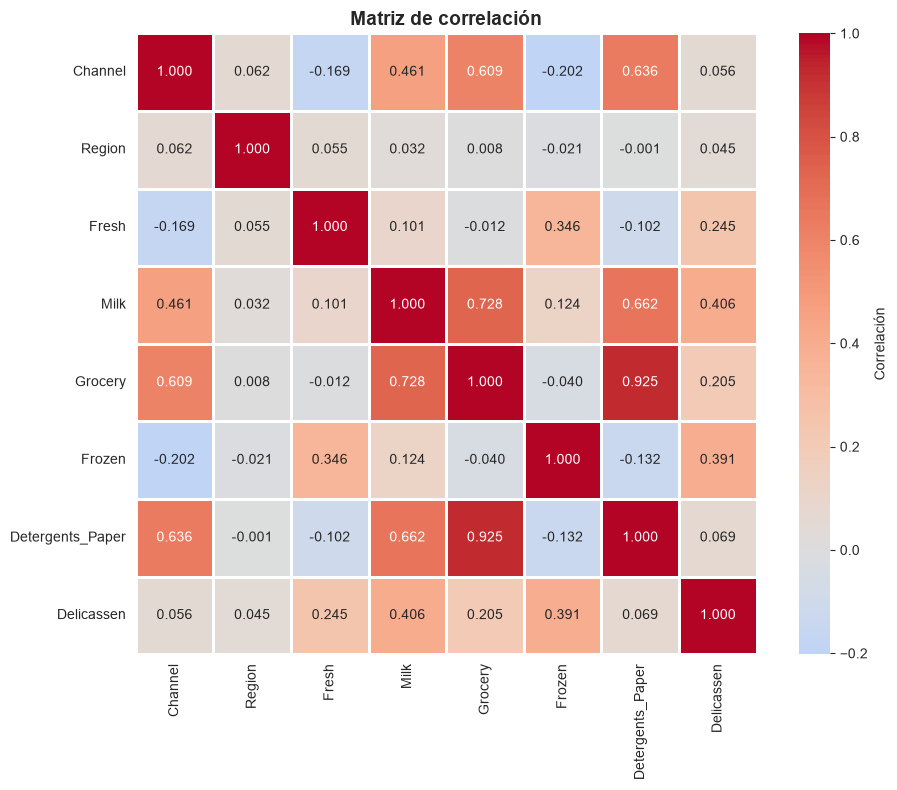
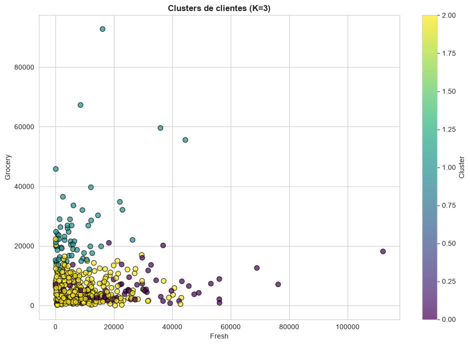
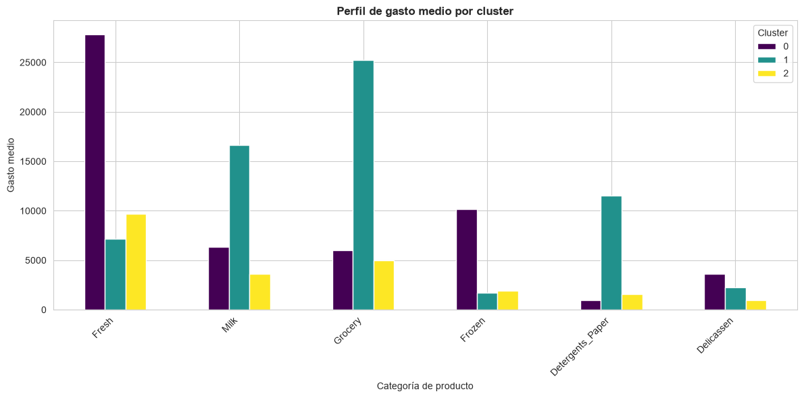
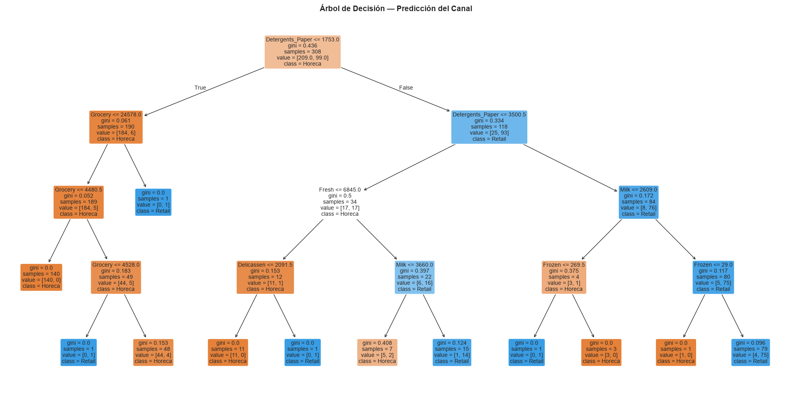
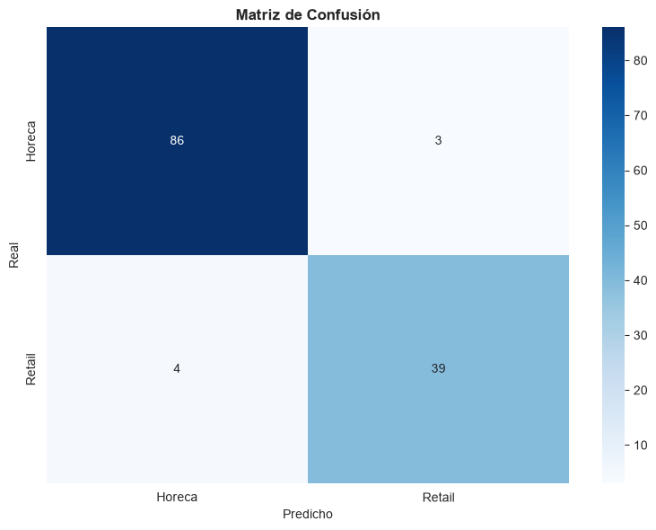
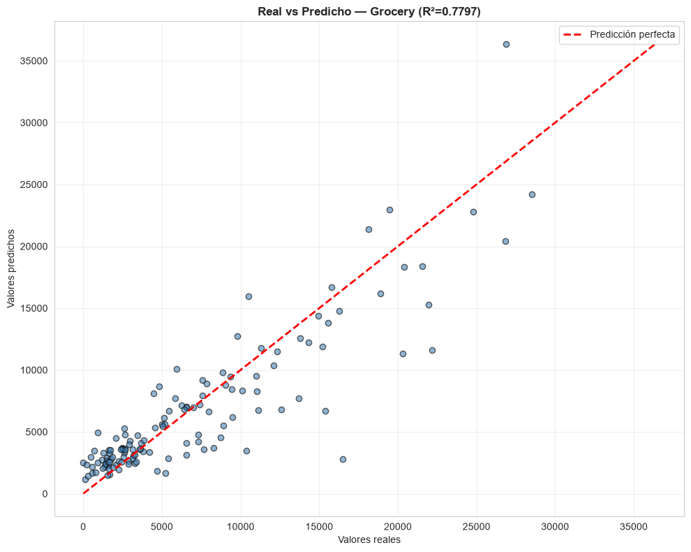
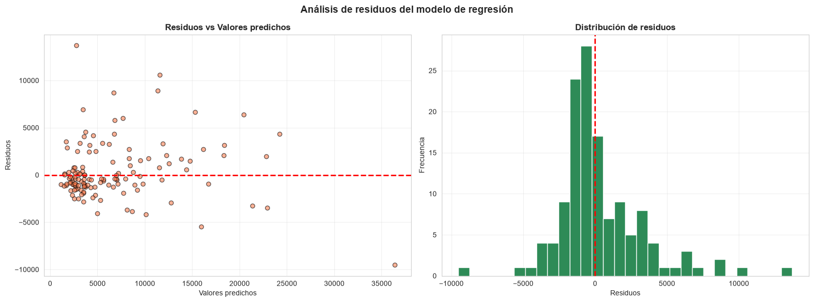

# 🔍 Reto 8 — Data Mining con Python

[](https://www.python.org/)
[](https://scikit-learn.org/)
[](https://pandas.pydata.org/)
[](https://numpy.org/)
[](https://matplotlib.org/)
[](https://seaborn.pydata.org/)
[](LICENSE)
[]()
[](https://archive.ics.uci.edu/ml/datasets/Wholesale+customers)

Proyecto de **Data Mining** que aplica técnicas de **clustering**, **clasificación** y **regresión** al dataset **Wholesale Customers** de UCI.

---

## 🎯 Objetivo

Extraer insights valiosos del comportamiento de compra de **440 clientes mayoristas** mediante:

- **Clustering (K-means)** → Segmentación de clientes
- **Clasificación (Árbol de decisión)** → Predicción del canal de compra
- **Regresión (Regresión lineal)** → Predicción del gasto total

---

## 📊 Dataset

| Atributo | Valor |
|---|---|
| **Fuente** | [UCI Machine Learning Repository](https://archive.ics.uci.edu/ml/datasets/Wholesale+customers) |
| **Registros** | 440 clientes mayoristas |
| **Variables** | 8 (`Channel`, `Region`, `Fresh`, `Milk`, `Grocery`, `Frozen`, `Detergents_Paper`, `Delicassen`) |
| **Tipo** | Datos de gasto anual por categoría de producto |

---

## 🛠️ Tecnologías utilizadas

<p align="center">
  
  
  
  
  
  
</p>

| Herramienta | Uso |
|---|---|
| **Python 3.13** | Lenguaje principal |
| **pandas** | Manipulación de datos |
| **scikit-learn** | Modelos de ML (K-means, Decision Tree, Linear Regression) |
| **NumPy** | Operaciones numéricas |
| **matplotlib / seaborn** | Visualizaciones |

---

## 📁 Estructura del proyecto

```
Reto8_DataMining/
│
├── datos/
│   ├── raw/                                  # Dataset original
│   │   └── wholesale_customers.csv
│   └── limpios/                              # Datasets procesados
│       ├── wholesale_preparado.csv
│       ├── wholesale_minmax.csv
│       └── wholesale_con_clusters.csv
│
├── scripts/                                  # Scripts por fase
│   ├── 01_exploracion.py
│   ├── 02_preparacion.py
│   ├── 03_clustering.py
│   ├── 04_clasificacion.py
│   ├── 05_regresion.py
│   └── 06_evaluacion.py
│
├── modelos/                                  # Modelos entrenados (.pkl)
│   ├── modelo_clustering_kmeans.pkl
│   ├── modelo_clasificacion_tree.pkl
│   └── modelo_regresion_lineal.pkl
│
├── salidas/
│   ├── figuras/                              # 14 visualizaciones PNG
│   └── resultados/                           # 11 CSVs con métricas
│
├── docs/                                     # Entregables
│   ├── Informe_Analisis_Reto8_JuditGiravent.md
│   ├── Informe_Analisis_Reto8_JuditGiravent.pdf
│   ├── Documentacion_Evaluation_Reto8_JuditGiravent.md
│   ├── Documentacion_Evaluation_Reto8_JuditGiravent.pdf
│   └── Presentacion_DataMining_Reto8_JuditGiravent.pptx
│
├── .gitignore
├── LICENSE
└── README.md
```

---

## 📊 Resultados de los modelos

| Técnica | Métrica | Valor | Interpretación |
|---|---|---|---|
| **Clustering** (K-means, K=3) | Silhouette | **0,3953** | 3 segmentos identificados |
| **Clasificación** (Árbol de decisión) | F1-score | **0,9468** | Excelente predicción del canal |
| **Regresión** (Regresión lineal) | R² | **0,7797** | Explica el 78% de la varianza |

---

## 💡 Hallazgos clave

1. **3 segmentos de clientes** bien diferenciados:
   - **Fresh alto** → restaurantes (Horeca)
   - **Grocery alto** → tiendas (Retail)
   - **Pequeños** → bajo gasto general

2. **`Detergents_Paper`** es la variable dominante (**79,6%**) para predecir el canal de compra.

3. **71,6% de los clientes** son pequeños y aportan poco valor.

4. El modelo de clasificación puede predecir con **94,7% de precisión** si un cliente es **Horeca** o **Retail**.

---

## 🚀 Cómo reproducir el proyecto

### 1. Clonar el repositorio

```bash
git clone https://github.com/jdthgp27/Reto8_DataMining.git
cd Reto8_DataMining
```

### 2. Instalar dependencias

```bash
pip install pandas numpy scikit-learn matplotlib seaborn
```

### 3. Descargar el dataset

Descarga `Wholesale customers data.csv` desde [UCI](https://archive.ics.uci.edu/ml/datasets/Wholesale+customers) y colócalo en `datos/raw/` con el nombre `wholesale_customers.csv`.

### 4. Ejecutar los scripts en orden

```bash
cd scripts

python 01_exploracion.py
python 02_preparacion.py
python 03_clustering.py
python 04_clasificacion.py
python 05_regresion.py
python 06_evaluacion.py
```

Los resultados se guardan automáticamente en:
- `salidas/figuras/` → 14 visualizaciones
- `salidas/resultados/` → 11 CSVs con métricas
- `modelos/` → 3 modelos `.pkl`

---

## 📸 Visualizaciones destacadas

### Análisis exploratorio





### Clustering





### Clasificación





### Regresión





---

## 📄 Documentación

| Documento | Enlace |
|---|---|
| 📘 **Informe de análisis (PDF)** | [Ver informe](docs/Informe_Analisis_Reto8_JuditGiravent.pdf) |
| 📝 **Informe de análisis (MD)** | [Ver informe](docs/Informe_Analisis_Reto8_JuditGiravent.md) |
| 📊 **Documentación de evaluación (PDF)** | [Ver documentación](docs/Documentacion_Evaluation_Reto8_JuditGiravent.pdf) |
| 📝 **Documentación de evaluación (MD)** | [Ver documentación](docs/Documentacion_Evaluation_Reto8_JuditGiravent.md) |
| 🎤 **Presentación ejecutiva (PPTX)** | [Ver presentación](docs/Presentacion_DataMining_Reto8_JuditGiravent.pptx) |

---

## 🎓 Conclusiones

Este proyecto demuestra la aplicación práctica de las **tres técnicas principales de Data Mining**:

- **Clustering** para segmentación no supervisada
- **Clasificación** para predicción categórica
- **Regresión** para predicción de valores continuos

Los resultados validan que:

- Los clientes mayoristas se agrupan en **3 perfiles claros** según su patrón de gasto
- Es posible **predecir el canal de compra** con alta precisión (94,7%)
- El **gasto total** se puede modelar con un buen ajuste lineal (R²=0,78)

---

## 🔄 Próximas mejoras

- [ ] Probar otros algoritmos de clustering (DBSCAN, Jerárquico)
- [ ] Comparar con otros clasificadores (Random Forest, XGBoost)
- [ ] Añadir validación cruzada a los modelos
- [ ] Dashboard interactivo con los resultados
- [ ] Análisis de sensibilidad del número de clusters

---

## 👤 Autora

**Judit Giravent Pineda**

- GitHub: [@jdthgp27](https://github.com/jdthgp27)
- LinkedIn: [judit-giravent-27b167156](https://www.linkedin.com/in/judit-giravent-27b167156/)
- Email: jdthgp27@gmail.com

---

## 📜 Licencia

Este proyecto está bajo la **Licencia MIT**. Consulta el archivo [LICENSE](LICENSE) para más detalles.

---

## 🙏 Agradecimientos

- [UCI Machine Learning Repository](https://archive.ics.uci.edu/ml/datasets/Wholesale+customers) por el dataset **Wholesale Customers**.

---

⭐ Si este proyecto te ha resultado útil, considera darle una estrella en GitHub.